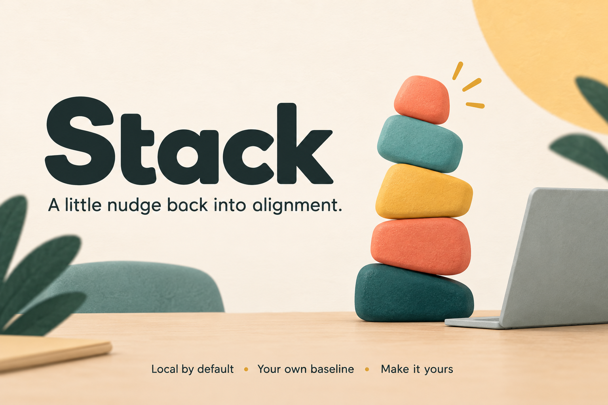
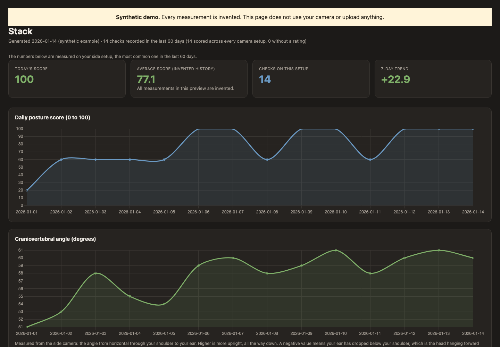

# Stack



**A quiet posture helper for your Mac.** Set a comfortable baseline, get a gentle
nudge when you drift, and see your patterns in a local dashboard. One camera is
enough to start; a second side view adds more measurements.

I built this for myself and my own desk. Make it your own, and feel free to
improve mine. Hopefully it gives you a useful starting point, or at least a few
ideas. Cheers!

> **Start here:** [Download Stack for Apple Silicon Mac](https://github.com/jessecmaddox3/stack-posture/releases/latest/download/Stack.zip).
> Unzip it and double-click **Set Up Stack.command**. No Git or coding experience
> needed. Requires **an M1 or newer Mac running macOS 13 or newer**. This is guided
> source installation, not a signed Mac app.

[](https://github.com/jessecmaddox3/stack-posture/actions/workflows/tests.yml)
[](LICENSE)

## See what you get

**Want a look before installing?** [Download the sample dashboard](https://github.com/jessecmaddox3/stack-posture/releases/latest/download/Stack-Demo.html),
then double-click that HTML file. It opens in your browser, works offline and
uses entirely invented measurements. It does not turn on your camera.



- **Your baseline:** measurements relative to how you choose to sit.
- **Gentle nudges:** sustained drift triggers a reminder, with a cooldown.
- **Local history:** charts separate camera setups and changed baselines.
- **Flexible cameras:** front, side, or both. Cameras are released between samples.
- **Optional AI second opinion:** Gemini comparison and coaching, off by default.

The header is generated artwork. The screenshot is the real dashboard with
synthetic data. This is a personal experiment with camera-based heuristics, not
a medical assessment or a validated measure of health.

## Set it up, step by step

1. **Download and unzip [Stack.zip](https://github.com/jessecmaddox3/stack-posture/releases/latest/download/Stack.zip).**
   Move the Stack folder somewhere you will keep it, such as your Applications folder.
2. **Double-click `Set Up Stack.command`.** A Terminal window opens and explains
   what happens next. If needed, it offers to install the small [uv dependency
   manager](https://docs.astral.sh/uv/getting-started/installation/), then downloads
   Python, the locked dependencies and a verified 9.4 MB pose model. Initial setup
   needs an internet connection; normal local monitoring does not.
3. **Choose your camera.** Setup asks before turning it on. Allow camera access
   if macOS prompts. Preview a camera, press a key to close its preview, then
   choose front or side. A second camera is optional. Previews are never saved.
4. **Set your baseline.** Sit comfortably and hold still for ten seconds. Stack
   saves numeric measurements. If it cannot see enough, it explains how to retry.
5. **Double-click `Open Stack.command`.** Keep that Terminal window open. Find
   **▤** in your Mac's top menu bar, choose **Check Now**, then **Start Monitoring**.
   Stack opens Idle so monitoring starts when you choose it.

If macOS blocks the downloaded launcher, use [Apple's instructions for approving
downloaded software](https://support.apple.com/guide/mac-help/open-a-mac-app-from-an-unknown-developer-mh40616/mac).
You do not need to disable your Mac's security settings.

**No camera found?** Allow your Terminal/Python launcher in System Settings →
Privacy & Security → Camera, close other apps using that camera, and choose Retry.
[Apple's camera-permission guide](https://support.apple.com/guide/mac-help/control-access-to-the-camera-mchlf6d108da/mac)
explains that setting. Hardware and permission behavior can vary.

**Later:** use `Open Stack.command` to reopen it. To change your camera or
baseline, choose Quit in Stack's menu, then double-click `Recalibrate Stack.command`.
Run setup again after updating to a new release. Keep existing settings when asked.

## What stays on your Mac

By default, camera frames are processed in memory and discarded. Stack does not
read a Gemini API key or upload images unless you explicitly enable Gemini.
Setup and calibration never use Gemini, even if you have enabled it for monitoring.

Your settings, numeric baseline, history, logs and generated dashboard live in
`~/.posture_monitor/`. In Finder, choose Go → Go to Folder and paste that path to
find them. The established folder name is retained for existing users. These files
can be personal, so review them before sharing. The public demo contains none of them.

Advanced exceptions: `store_calibration_frames = true` enables a local frame
store during monitoring. The legacy `scripts/identify_cameras.py` explicitly
writes full-frame previews; the guided setup above does not. Keep those options
separate from ordinary setup, and do not commit their output.

## Optional Gemini coaching

Everything above works without an account or API key. Enabling Gemini sends a
cropped, downscaled image of the person to Google's API. The crop can still show
things directly behind you. Google service terms apply, and API calls may cost
money. Gemini adds text and comparison statistics; it does not decide local
scores or nudges.

If you choose to enable it, open Terminal in the Stack folder and run:

```bash
.venv/bin/python scripts/set_gemini_key.py
```

The prompt hides your key and stores it in macOS Keychain. It does not enable
uploads. Add these **top-level** settings before `[cameras]` in your local
`~/.posture_monitor/config.toml`, then restart Stack:

```toml
gemini_enabled = true
comparison_sample_rate = 0.15
max_coaching_calls_per_day = 12
```

The comparison rate samples about 15% of recording windows; it is separate from
the coaching limit of 12 calls per day. Set either to zero to disable that path.
Set `gemini_enabled = false` to stop all Gemini calls. Use real TOML booleans,
without quotation marks. A locally set `POSTURE_GEMINI_API_KEY` environment variable
is an alternative to Keychain. Never put a key in this repository.

## Login launch, stopping and removal

To stop monitoring, use Stop Monitoring or Quit in the menu. To open Stack at
login, first get a successful Check Now reading, quit Stack, then run this from
its folder in Terminal:

```bash
./scripts/install_autostart.sh
```

This opens Stack **Idle**, not automatically monitoring. Verify Check Now after
login because macOS can treat background camera permission differently. Keep the
Stack folder in place. To remove login launch:

```bash
./scripts/uninstall_autostart.sh
```

After quitting and removing login launch, you can delete the Stack folder. Your
history remains in `~/.posture_monitor/` until you separately choose to delete it.

## How I designed it

Local MediaPipe landmarks feed geometric measurements, compared with a versioned
baseline. Sustained changes and cooldowns keep reminders from reacting to every
movement. SQLite stores numeric checks and the baseline used for each one. The
dashboard avoids treating different camera setups or recalibrations as one
continuous, directly comparable score.

Front view can measure alignment, but cannot see forward head position or trunk
lean. Those require a stable side view. Move a camera and you should recalibrate.
Measurements depend on framing and visibility; missing measurements stay missing.
The optional model comparison is separately sampled, so it is not selected only
from checks the local system already considers poor.

## Developers and contributors

Use an Apple Silicon Mac on macOS 13+ with [uv](https://docs.astral.sh/uv/):

```bash
git clone https://github.com/jessecmaddox3/stack-posture.git
cd stack-posture
uv sync --extra dev --locked
uv run python -m posture.demo
uv run python -m pytest -q tests
uv run ruff check src tests scripts
uv build
```

The default tests use synthetic inputs and block camera, network, Keychain and
personal-state access. Native pose inference is a separate opt-in check with an
explicit test-only model path, described in [CONTRIBUTING.md](CONTRIBUTING.md).
Automated tests do not establish real camera compatibility, popup placement or
macOS login behavior on every device.

Have an improvement? Read [CONTRIBUTING.md](CONTRIBUTING.md). This project's code is
[MIT licensed](LICENSE): use it, change it, share it, including commercially,
while keeping the license notice. [NOTICE.md](NOTICE.md) covers third-party
components. [SECURITY.md](SECURITY.md) explains private vulnerability reporting.
